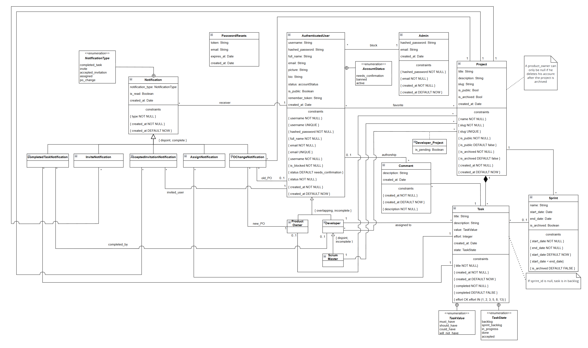

# EBD: Database Specification Component

Scrumbled fosters an environment where agile project management is approachable and straightforward while enabling teams to adopt and master the Scrum methodology with ease. Improving team collaboration is key, with each sprint serving as an opportunity for effective, transparent, and targeted advancement.

## A4: Conceptual Data Model

The Conceptual Data Model is useful for defining the entities and relationships that will be present in the final system. It also provides an overview of the data that is needed in the final database.

### 1. Class diagram

The UML diagram in Figure 1 presents the classes and their attributes, the relationships between the tables and their multiplicities.

For the Notifications, we decided to follow a Use Nulls strategy, since there are many attributes that are shared among the several notification types.

<figure>

{width=1233 height=731}

<figcaption>Figure 1: Scrumbled conceptual data model in UML.</figcaption>
</figure>

### 2. Additional Business Rules

- BR01. Upon account deletion, shared user data is kept but is made anonymous

- BR02. Banned users will have their information saved, but won't be eligible to enter the site with their credentials

- BR03. In public projects, task interactions are limited to team members, while project information remains viewable to non-members.

- BR04. Product Owners and Administrators can archive projects. Archived projects can still be viewed by team members and Administrators but cannot be modified.

- BR05. After transfering ownership the original owner retains the role of Developer, unless reassigned.

- BR06. A Team Member can only have one role in a project he is enrolled in.

- BR7. When a sprint is marked as complete, all the tasks that weren't Accepted, will return to the project backlog.

- BR8. A developer can't assign himself to a task someone else has already assigned him to.

---

## A5: Relational Schema, validation and schema refinement

In this artifact we are going to check if what has been modeled allows us to store data efficiently by reducing redundancy, avoiding update anomalies, and ensuring data integrity.

### 1. Relational Schema

The Relational Schema includes the attributes, domains, primary keys, foreign keys and other integrity rules: UNIQUE, DEFAULT, NOT NULL, CHECK.
Relational schemas are specified in the compact notation:

| Relation reference | Relation Compact Notation                                                                                                                                                                                                                                                                             | 
|--------------------|-------------------------------------------------------------------------------------------------------------------------------------------------------------------------------------------------------------------------------------------------------------------------------------------------------|
| R01                | admin(<ins>id</ins>, hashed_password **NN**, email **NN UK**, created_at **NN DF** Now)                                                                                                                                                                                                                              |
| R02                | authenticated_user(<ins>id</ins>, username **UK NN**, bio, hashed_password **NN**, full_name **NN**, email **NN UK**, picture, status **NN** **CK** status **IN** AccountStatus **DF** "needs_confirmation", is_public **NN** **DF** true, remember_token, created_at **NN DF** Now)                                                                               |
| R03                | product_owner(<ins>user_id</ins> -\> authenticated_user)                                                                                                                                                                                                                                                             |
| R04                | developer(<ins>user_id</ins> -\> authenticated_user)                                                                                                                                                                                                                                                                 |
| R05                | scrum_master(<ins>developer_id</ins> -\> developer)                                                                                                                                                                                                                                                                  |
| R06                | project(<ins>id</ins>, slug **NN UK**, title **NN UK**, description, product_owner_id -\> product_owner, scrum_master_id -\> scrum_master, is_public **NN DF** false, is_archived **NN DF** false, created_at **NN DF** Now)                                                                                         |
| R07                | favorite(<ins>user_id</ins> -\> authenticated_user, <ins>project_id</ins> -\> project)                                                                                                                                                                                                                               |
| R08                | developer_project(<ins>developer_id</ins> -\> developer, <ins>project_id</ins> -\> project, is_pending **NN DF** true)                                                                                                                                                                                               |
| R09                | sprint(<ins>id</ins>, project_id -\> project **NN**, name, start_date **NN DF** Now, end_date **NN CK** end_date \> start_date, is_archived **NN** **DF** false)                                                                                                                                                                                      |
| R10                | task(<ins>id</ins>, project_id -\> project **NN**, sprint_id -\> sprint, title **NN**, description, assigned_to -\> developer, value **CK** value **IN** TaskValues, effort **CK** effort **IN** (1, 2, 3, 5, 8, 13), state **CK** state **IN** TaskState, created_at **NN DF** Now) 
| R11                | comment(<ins>id</ins>, task_id -\> task **NN**, user_id-\>authenticated_user **NN**, description **NN**, created_at **NN DF** Now)                                                                                                                                                                                   |
| R12                | notification(<ins>id</ins>, receiver_id **NN** -\> authenticated_user, type **NN**, project_id -\> project, old_product_owner_id -\> product_owner, new_product_owner_id -\> product_owner, task_id -\> task, invited_user_id -\> authenticated_user, completed_by -\> authenticated_user, created_at **NN DF** NOW, is_read **NN** **DF** false) |
| R13                | password_resets(<ins>id</ins>, email **NN UK**, token **NN UK**, expires_at **NN**, created_at **DF** Now)                                         |


### 2. Domains

Additional domains:

| Domain Name | Domain Specification |
|-------------|----------------------|
| Now | DATETIME DEFAULT CURRENT_DATETIME |
| AccountStatus | ENUM ('needs_confirmation', 'active', 'banned') |
| TaskValue | ENUM ('must_have', 'should_have', 'could_have', 'will_not_have') |
| TaskState | ENUM ('backlog', 'sprint_backlog' , 'in_progress', 'done', 'accepted') |
| NotificationType | ENUM ('completed_task', 'invite', 'accepted_invitation', 'assign', 'po_change') |

### 3. Schema validation

Below are the tables of the FD's and the schema validation for the normal forms:

| **TABLE R01**                | admin                                     |
|------------------------------|-------------------------------------------|
| **Keys**                     | { id }, { email }                         |
| **Functional Dependencies:** |                                           |
| FD0101                       | id → {hashed_password, email, created_at} |
| FD0102                       | email → {id, hashed_password, created_at} |
| **NORMAL FORM**              | BCNF                                      |

| **TABLE R02**                | authenticated_user                                                                                                            |
|------------------------------|-------------------------------------------------------------------------------------------------------------------------------|
| **Keys**                     | { id }, { username }, { email }                                                                                             |
| **Functional Dependencies:** |                                                                                                                               |
| FD0201                       | id → {username, hashed_password, full_name, email, picture, bio, status, is_public, , remember_token, created_at} |
| FD0202                       | username → {id, hashed_password, full_name, email, picture, bio, status, is_public, , remember_token, created_at} |
| FD0203                       | email → {id, username, hashed_password, full_name, picture, bio, status, is_public, , remember_token, created_at} |
| **NORMAL FORM**              | BCNF                                                                                                                          |

| **TABLE R03**                | product_owner |
|------------------------------|---------------|
| **Keys**                     | { user_id }   |
| **Functional Dependencies:** |               |
| -                            |               |
| **NORMAL FORM**              | BCNF          |

| **TABLE R04**                | developer   |
|------------------------------|-------------|
| **Keys**                     | { user_id } |
| **Functional Dependencies:** |             |
| -                            |             |
| **NORMAL FORM**              | BCNF        |

| **TABLE R05**                | scrum_master     |
|------------------------------|------------------|
| **Keys**                     | { developer_id } |
| **Functional Dependencies:** |                  |
| -                            |                  |
| **NORMAL FORM**              | BCNF             |

| **TABLE R06**                | project                                                                                                  |
|------------------------------|----------------------------------------------------------------------------------------------------------|
| **Keys**                     | { id }, { slug }, { title }                                                                              |
| **Functional Dependencies:** |                                                                                                          |
| FD0601                       | id -\> {slug, title, description, product_owner_id, scrum_master_id, is_public, is_archived, created_at} |
| FD0602                       | slug -\> {id, title, description, product_owner_id, scrum_master_id, is_public, is_archived, created_at} |
| FD0603                       | title -\> {id, slug, description, product_owner_id, scrum_master_id, is_public, is_archived, created_at} |
| **NORMAL FORM**              | BCNF                                                                                                     |

| **TABLE R07**                | favorite                        |
|------------------------------|---------------------------------|
| **Keys**                     | { id }, { user_id, project_id } |
| **Functional Dependencies:** |                                 |
| FD0701                       | id → {user_id, project_id}      |
| FD0702                       | user_id, project_id → {id}      |
| **NORMAL FORM**              | BCNF                            |

| **TABLE R08**                | developer_project                           |
|------------------------------|---------------------------------------------|
| **Keys**                     | { developer_id, project_id }                |
| **Functional Dependencies:** |                                             |
| FD0801                       | developer_id, project_id → {id, is_pending} |
| **NORMAL FORM**              | BCNF                                        |

| **TABLE R09**                | sprint                                                                                          |
|------------------------------|-------------------------------------------------------------------------------------------------|
| **Keys**                     | { id }                                                                                          |
| **Functional Dependencies:** |                                                                                                 |
| FD0901                       | id → {project_id, name, start_date, end_date, is_archived}                                      |
| **NORMAL FORM**              | BCNF                                                                                            |

| **TABLE R10**                | task                                                                                                            |
|------------------------------|-----------------------------------------------------------------------------------------------------------------|
| **Keys**                     | { id }                                                                                                          |
| **Functional Dependencies:** |                                                                                                                 |
| FD1001                       | id → {project_id, sprint_id, title, description, assigned_to, value, effort, state, created_at}                        |
| **NORMAL FORM**              | BCNF                                                                                                            |

| **TABLE R11**                | comment                                          |
|------------------------------|--------------------------------------------------|
| **Keys**                     | { id }, { user_id, created_at }                  |
| **Functional Dependencies:** |                                                  |
| FD1101                       | id → {task_id, user_id, description, created_at} |
| FD1102                       | user_id, created_at → {id, task_id, description} |
| **NORMAL FORM**              | BCNF                                             |

| **TABLE R12**                | notification                                                                                                                           |
|------------------------------|----------------------------------------------------------------------------------------------------------------------------------------|
| **Keys**                     | { id }                                                                                                                                 |
| **Functional Dependencies:** |                                                                                                                                        |
| FD1201                       | id → {receiver_id, type, project_id, old_product_owner_id, new_product_owner_id, task_id, invited_user_id, completed_by, created_at}   |
| **NORMAL FORM**              | BCNF                                                                                                                                   |

| **TABLE R13**                | password_resets                               |
|------------------------------|-----------------------------------------------|
| **Keys**                     | { id }, { email }, { token }                  |
| **Functional Dependencies:** |                                               |
| FD1301                       | id -\> {email, token, expires_at, created_at} |
| FD1302                       | email -\> {id, token, expires_at, created_at} |
| FD1303                       | token -\> {id, email, expires_at, created_at} |
| **NORMAL FORM**              | BCNF                                          |

Since all relations have atomic values (each field contains indivisible values) and have no repeating groups or arrays of values they all validate the 1st Normal Form.

Since all relations are in 1st Normal Form and have no partial dependencies (no attribute depends only on a part of the key) they are in 2nd Normal Form.

Finally a relation is in BCNF if the left side of the FD's (Functional Dependencies) are super keys. Since in all tables this condition applies we can conclude that all tables are in BCNF. Lastly, since all tables are in BCNF we can conclude that they are also in 3rd Normal Form.

---

## A6: Indexes, triggers, transactions and database population

In this artifact we present the schema of the database and its implementation. It contains the characteristics of indexes and triggers (for data integrity). It also contains the transactions that are needed in case of concurrent accesses, specifying the isolation level for each transaction.

We also present the database's workload, which indicates an estimated workload for each relation.

This artifact includes all SQL needed to define integrity contraints, indexes, triggers and transactions, in form of a creation script. A population script is also available in this artifact.

### 1. Database Workload

The following table shows an estimate of the database load:

| **Relation reference** | **Relation Name** | **Order of magnitude** | **Estimated growth** |
|------------------------|-------------------|------------------------|----------------------|
| R01 | admin | 10 | 1/month |
| R02 | authenticated_user | 10k | 10/day |
| R03 | product_owner | 1k | 1/day |
| R04 | developer | 10k | 10/day |
| R05 | scrum_master | 1k | 1/day |
| R06 | project | 1k | 1/day |
| R07 | favorite | 10k | 10/day |
| R08 | developer_project | 100k | 100/day |
| R09 | notification | 1M | 10k/day |
| R10 | comment | 100k | 10k/day |
| R11 | task | 100k | 1k/day |
| R12 | sprint | 10k | 10/day |
| R13 | password_resets | 1k | 1/day |

### 2. Proposed Indices

#### 2.1. Performance Indices

Below are some indices that aim to enhance query performance:

| **Index** | IDX01 |
|-----------|-------|
| **Relation** | notification |
| **Attribute** | receiver_id |
| **Type** | Hash |
| **Cardinality** | Medium |
| **Clustering** | No |
| **Justification** | The notification table requires efficient filtering by receiver_id, as it is frequently accessed in queries. A hash index on receiver_id was chosen because it offers fast lookup times, which is suitable given the cardinality of this column. Since the table is large and accessed frequently, a hash index will improve query performance. |
| SQL code | `CREATE INDEX IDX01 ON notification USING HASH (receiver_id);` |

---

| **Index** | IDX02 |
|-----------|-------|
| **Relation** | comment |
| **Attribute** | task_id |
| **Type** | B-tree |
| **Cardinality** | High |
| **Clustering** | Yes |
| **Justification** | The comment table is very large, and many queries filter comments by task. A B-tree index on task_id was chosen to support range queries and to allow clustering for faster retrieval of task-related comments. Clustering ensures related records are stored close together, improving access time for sequential queries. |
| **SQL code** | `CREATE INDEX IDX02 ON comment USING BTREE (task_id);` |

---

| **Index** | IDX03 |
|-----------|-------|
| **Relation** | task |
| **Attribute** | project_id |
| **Type** | B-tree |
| **Cardinality** | Medium |
| **Clustering** | No |
| **Justification** | The task table requires frequent filtering by project_id to retrieve all tasks under a specific project. A B-tree index on project_id was selected to support efficient retrieval for these queries, and clustering was not necessary since tasks do not need to be stored in project-related order. |
| **SQL code** | `CREATE INDEX IDX03 ON task USING BTREE (project_id);` |

#### 2.2. Full-text Search Indices

The following tables show the SQL code for full-text search support.

| **Index** | IDX04 |
|-----------|-------|
| **Relation** | project |
| **Attribute** | title, description |
| **Type** | GIN |
| **Clustering** | No |
| **Justification** | This index helps provide full text search features over the title and the description of the project relation. Since indexed fields are not expected to change often we opted to use GIN as our index type. |

##### SQL code

```sql
-- Add column to project to store computed ts_vectors.
ALTER TABLE project
ADD COLUMN tsvectors TSVECTOR;

-- Create a function to automatically update ts_vectors.
CREATE FUNCTION project_search_update() RETURNS TRIGGER AS $$
BEGIN
 IF TG_OP = 'INSERT' THEN
        NEW.tsvectors = (
         setweight(to_tsvector('english', NEW.title), 'A') ||
         setweight(to_tsvector('english', NEW.description), 'B')
        );
 END IF;
 IF TG_OP = 'UPDATE' THEN
         IF (NEW.title <> OLD.title OR NEW.description <> OLD.description) THEN
           NEW.tsvectors = (
             setweight(to_tsvector('english', NEW.title), 'A') ||
             setweight(to_tsvector('english', NEW.description), 'B')
           );
         END IF;
 END IF;
 RETURN NEW;
END $$
LANGUAGE plpgsql;

-- Create a trigger before insert or update on project.
CREATE TRIGGER project_search_update
 BEFORE INSERT OR UPDATE ON project
 FOR EACH ROW
 EXECUTE PROCEDURE project_search_update();


-- Finally, create a GIN index for ts_vectors.
CREATE INDEX project_search_idx ON project USING GIN (tsvectors);
```

| **Index** | IDX05 |
|-----------|-------|
| **Relation** | authenticated_user |
| **Attribute** | username, full_name, bio |
| **Type** | GIN |
| **Clustering** | No |
| **Justification** | This index helps provide full text search features over the username, full_name and the bio of the authenticated_user relation. Since indexed fields are not expected to change often we opted to use GIN as our index type. |

##### SQL code

```sql
-- Add column to authenticated_user to store computed ts_vectors.
ALTER TABLE authenticated_user ADD COLUMN tsvectors TSVECTOR;

-- Create a function to automatically update ts_vectors.
CREATE FUNCTION authenticated_user_search_update() RETURNS TRIGGER AS $$
BEGIN
 IF TG_OP = 'INSERT' THEN
        NEW.tsvectors = (
         setweight(to_tsvector('english', NEW.username), 'A') ||
         setweight(to_tsvector('english', NEW.full_name), 'B') ||
         setweight(to_tsvector('english', NEW.bio), 'C')
        );
 END IF;
 IF TG_OP = 'UPDATE' THEN
         IF ((NEW.username <> OLD.username) || (NEW.full_name <> OLD.full_name) || (NEW.bio <> OLD.bio)) THEN
           NEW.tsvectors = (
             setweight(to_tsvector('english', NEW.username), 'A') ||
             setweight(to_tsvector('english', NEW.full_name), 'B') ||
             setweight(to_tsvector('english', NEW.bio), 'C')
           );
         END IF;
 END IF;
 RETURN NEW;
END $$
LANGUAGE plpgsql;

-- Create a trigger before insert or update on authenticated_user.
CREATE TRIGGER authenticated_user_search_update
 BEFORE INSERT OR UPDATE ON authenticated_user
 FOR EACH ROW
 EXECUTE PROCEDURE authenticated_user_search_update();


-- Finally, create a GIN index for ts_vectors.
CREATE INDEX auth_user_search_idx ON authenticated_user USING GIN (tsvectors);
```

### 3. Triggers

Below are some triggers that ensure that the database does not lose its integrity.

| **Trigger** | TRIGGER01 |
|-------------|-----------|
| **Description** | When changing the product owner (i.e. updating product_owner_id in project), a notification should be created for each team member. |

##### SQL code

```sql
-- Create a function to create a notification when the product owner changes.
CREATE OR REPLACE FUNCTION create_po_change_notification() RETURNS TRIGGER AS $$
DECLARE
    dev_id BIGINT;
BEGIN
    -- Check if the new product owner ID is not null
    IF NEW.product_owner_id IS NOT NULL THEN
        -- Loop through each developer of the project and send a notification
        FOR dev_id IN
            SELECT developer_id
            FROM developer_project
            WHERE project_id = NEW.id AND is_pending = FALSE
        LOOP
            INSERT INTO notification (receiver_id, type, project_id, old_product_owner_id, new_product_owner_id)
            VALUES (dev_id, 'PO_CHANGE', NEW.id, OLD.product_owner_id, NEW.product_owner_id);
        END LOOP;

        -- Send a notification to the new product owner
        IF NEW.product_owner_id IS DISTINCT FROM OLD.product_owner_id THEN
            INSERT INTO notification (receiver_id, type, project_id, old_product_owner_id, new_product_owner_id)
            VALUES (NEW.product_owner_id, 'PO_CHANGE', NEW.id, OLD.product_owner_id, NEW.product_owner_id);
        END IF;
    END IF;

    RETURN NEW;
END;
$$ LANGUAGE plpgsql;

-- Create a trigger to notify team members when the product owner changes.
CREATE TRIGGER po_change_notification_trigger
    AFTER UPDATE OF product_owner_id ON project
    FOR EACH ROW
    WHEN (OLD.product_owner_id IS DISTINCT FROM NEW.product_owner_id)
    EXECUTE PROCEDURE create_po_change_notification();
```

| **Trigger** | TRIGGER02 |
|-------------|-----------|
| **Description** | Check if the user is still a product owner on any non-archived projects before letting him delete his account. |

##### SQL code

```sql
-- Create a function to check if the user can be deleted.
CREATE OR REPLACE FUNCTION check_user_deletion() 
RETURNS TRIGGER AS $$
BEGIN
    IF NOT EXISTS (
        SELECT project.id 
        FROM authenticated_user 
        JOIN project ON authenticated_user.id = project.product_owner_id 
        WHERE authenticated_user.id = OLD.id 
        AND project.is_archived = false
    ) THEN
        RETURN OLD;
    ELSE
        RAISE EXCEPTION 'Cannot delete user with active projects';
    END IF;
END
$$ LANGUAGE plpgsql;

-- Create a trigger to check user deletion.
CREATE TRIGGER before_user_delete
BEFORE DELETE ON authenticated_user
FOR EACH ROW
EXECUTE PROCEDURE check_user_deletion();
```

| **Trigger** | TRIGGER03 |
|-------------|-----------|
| **Description** | When a developer's task is accepted, a notification is sent to everyone on the project. |

##### SQL code

```sql
-- Create a function to notify team members when a task is accepted.
CREATE FUNCTION create_completed_task_notification() RETURNS TRIGGER AS $$
DECLARE
    user_id BIGINT;
BEGIN
    IF NEW.state = 'ACCEPTED'::task_state THEN
        FOR user_id IN
            SELECT product_owner_id as user_id FROM project
            UNION
            SELECT developer_id as user_id FROM project JOIN developer_project ON project.id = developer_project.project_id
        LOOP
            INSERT INTO notification (receiver_id, type, task_id, completed_by, created_at) 
            VALUES (user_id, 'COMPLETED_TASK', NEW.id, NEW.assigned_to, now());
        END LOOP;
    END IF;
    RETURN NEW;
END
$$ LANGUAGE plpgsql;

-- Create a trigger to notify team members when a task is accepted.
CREATE TRIGGER developer_update_task
    BEFORE UPDATE ON task
    FOR EACH ROW
    EXECUTE PROCEDURE create_completed_task_notification();
```

| **Trigger** | TRIGGER04 |
|-------------|-----------|
| **Description** | This function handles the response to an invitation by updating the developer_project table, deleting the invite notification, and sending notifications to the product owner and scrum master. |

##### SQL code

```sql
-- Create a function to handle the response to an invitation.
CREATE OR REPLACE FUNCTION handle_invite_response()
RETURNS TRIGGER AS $$
BEGIN
    -- Delete the invite notification
    DELETE FROM notification
    WHERE receiver_id = NEW.developer_id AND project_id = NEW.project_id AND type = 'INVITE';

    -- Send notification to the project owner if receiver_id is different from invited_user_id
    INSERT INTO notification (receiver_id, type, project_id, invited_user_id, created_at)
    SELECT product_owner_id, 'ACCEPTED_INVITATION', NEW.project_id, NEW.developer_id, NOW()
    FROM project
    WHERE id = NEW.project_id AND product_owner_id <> NEW.developer_id;

    -- Send notification to the scrum master if receiver_id is different from invited_user_id
    INSERT INTO notification (receiver_id, type, project_id, invited_user_id, created_at)
    SELECT scrum_master_id, 'ACCEPTED_INVITATION', NEW.project_id, NEW.developer_id, NOW()
    FROM project
    WHERE id = NEW.project_id AND scrum_master_id <> NEW.developer_id;

    RETURN NEW;
END;
$$ LANGUAGE plpgsql;

-- Create a trigger to handle the response to an invitation.
CREATE TRIGGER handle_invite_response_trigger
    AFTER UPDATE OF is_pending
    ON developer_project
    FOR EACH ROW
    WHEN (NEW.is_pending = false)
    EXECUTE FUNCTION handle_invite_response();
```

| **Trigger** | TRIGGER05 |
|-------------|-----------|
| **Description** | This trigger is designed to automatically create a notification whenever a new developer is added to a project by inserting a row into the developer_project table. |

##### SQL code

```sql
-- Create a function to create a notification when a new developer is added to a project.
CREATE OR REPLACE FUNCTION create_pending_notification()
RETURNS TRIGGER AS $$
BEGIN
    INSERT INTO notification (
        receiver_id,
        type,
        project_id,
        invited_user_id,
        created_at
    )
    VALUES (
        NEW.developer_id,
        'INVITE',
        NEW.project_id,
        NEW.developer_id, -- Corrected field
        NOW()
    );

    RETURN NEW;
END;
$$ LANGUAGE plpgsql;

-- Create a trigger to notify when a new developer is added to a project.
CREATE TRIGGER trigger_create_invite_notification
AFTER INSERT ON developer_project
FOR EACH ROW
EXECUTE FUNCTION create_pending_notification();
```

| **Trigger** | TRIGGER06 |
|-------------|-----------|
| **Description** | When a developer is assigned to a task (i.e. when assigned_to is updated in task), that person should receive a notification. |

##### SQL code

```sql
-- Create a function to create a notification when a developer is assigned to a task.
CREATE OR REPLACE FUNCTION create_assign_notification() RETURNS TRIGGER AS $$
BEGIN
    -- Only insert a notification if assigned_to is not NULL
    IF NEW.assigned_to IS NOT NULL THEN
INSERT INTO notification (project_id, receiver_id, type, task_id)
VALUES (NEW.project_id, NEW.assigned_to, 'ASSIGN', NEW.id);
END IF;
RETURN NEW;
END;
$$ LANGUAGE plpgsql;

-- Create a trigger to notify when a developer is assigned to a task.
CREATE TRIGGER assign_notification_trigger
    AFTER UPDATE OF assigned_to ON task
    FOR EACH ROW
    WHEN (OLD.assigned_to IS DISTINCT FROM NEW.assigned_to) 
    EXECUTE PROCEDURE create_assign_notification();
```

| **Trigger** | TRIGGER07 |
|-------------|-----------|
| **Description** | This trigger ensures that a user is added to the appropriate role tables before creating a project. |

##### SQL code

```sql
-- Create a function to ensure the user is added to the appropriate role tables before creating a project.
CREATE OR REPLACE FUNCTION ensure_roles_before_project_insert() RETURNS TRIGGER AS $$
BEGIN
    -- Ensure the product owner is in the product_owner table
    IF NEW.product_owner_id IS NOT NULL AND NOT EXISTS (SELECT 1 FROM product_owner WHERE user_id = NEW.product_owner_id) THEN
        INSERT INTO product_owner (user_id) VALUES (NEW.product_owner_id);
    END IF;

    -- Ensure the scrum master is in the developer and scrum_master tables
    IF NEW.scrum_master_id IS NOT NULL AND NOT EXISTS (SELECT 1 FROM developer WHERE user_id = NEW.scrum_master_id) THEN
        INSERT INTO developer (user_id) VALUES (NEW.scrum_master_id);
    END IF;

    IF NEW.scrum_master_id IS NOT NULL AND NOT EXISTS (SELECT 1 FROM scrum_master WHERE developer_id = NEW.scrum_master_id) THEN
        INSERT INTO scrum_master (developer_id) VALUES (NEW.scrum_master_id);
    END IF;

    RETURN NEW;
END;
$$ LANGUAGE plpgsql;

-- Create a trigger to call the function before inserting a project.
CREATE TRIGGER before_project_insert
BEFORE INSERT ON project
FOR EACH ROW
EXECUTE FUNCTION ensure_roles_before_project_insert();
```

### 4. Transactions

The following transactions are needed to avoid concurrent accesses and to assure data integrity:

| SQL Reference | TRAN01 |
|---------------|--------|
| Justification | The isolation level is set to Repeatable Read because it prevents potential inconsistencies that could arise from concurrent transactions. If another transaction were to insert a new project with the same name while the current transaction is still active, it could lead to a violation of the unique constraint on the project name. |
| Isolation level | REPEATABLE READ |

#### Complete SQL Code

```sql
BEGIN TRANSACTION;

SET TRANSACTION ISOLATION LEVEL REPEATABLE READ;

INSERT INTO project (name, description, product_owner_id, scrum_master_id, is_public, is_archived, created_at) 
VALUES ($project_name, $description, $creator_user_id, NULL, $is_public, false, now());

INSERT INTO product_owner (user_id) VALUES ($creator_user_id);

END TRANSACTION;
```

| SQL Reference | TRAN02 |
|---------------|--------|
| Justification | This transaction handles the completion of a sprint by moving all tasks that are not in the 'ACCEPTED' state back to the backlog and then deleting the sprint. It ensures that tasks that are not accepted are properly managed before the sprint is removed from the system. |
| Isolation level | REPEATABLE READ |

#### Complete SQL Code

```sql
BEGIN TRANSACTION;

SET TRANSACTION ISOLATION LEVEL REPEATABLE READ;

-- Move tasks that are not 'ACCEPTED' back to the backlog
UPDATE task
SET sprint_id = NULL, state = 'BACKLOG'
WHERE sprint_id = $1 AND state != 'ACCEPTED';

-- Delete the sprint
DELETE FROM sprint
WHERE id = $1;

END TRANSACTION;
```

| SQL Reference | TRAN03 |
|---------------|--------|
| Description | This transaction tries to assign a task to a developer only if the task has not already been assigned to someone else. |
| Justification | This transaction helps enforce a rule that tasks can only be assigned to one developer at a time and prevents accidental overwriting of an existing assignment. |
| Isolation level | SERIALIZABLE |

#### Complete SQL Code

```sql
BEGIN TRANSACTION;

SET TRANSACTION ISOLATION LEVEL REPEATABLE READ;

DO $$
BEGIN
    IF (SELECT assigned_to FROM task WHERE id = $task_id) IS NULL THEN
        UPDATE task
        SET assigned_to = $developer_id
        WHERE id = $task_id;
    ELSE
        RAISE NOTICE 'Task is already assigned to someone else.';
    END IF;
END;
$$;

END TRANSACTION;
```

| SQL Reference | TRAN04 |
|---------------|--------|
| Description | This transaction deletes a user from the database and ensures that all related data is properly handled to maintain data integrity. |
| Justification | For tables with ON DELETE CASCADE, related rows will be automatically deleted. For other tables, the user ID will be set to NULL to anonymize the data. The isolation level is set to REPEATABLE READ to prevent potential inconsistencies from concurrent transactions. |
| Isolation level | SERIALIZABLE |

#### Complete SQL Code

```sql
BEGIN TRANSACTION;

-- Set the isolation level to REPEATABLE READ
SET TRANSACTION ISOLATION LEVEL REPEATABLE READ;

-- Anonymize related data in the comment table
UPDATE comment
SET user_id = NULL
WHERE user_id = $user_id;

-- Anonymize related data in the notification table
UPDATE notification
SET receiver_id = NULL
WHERE receiver_id = $user_id;

UPDATE notification
SET invited_user_id = NULL
WHERE invited_user_id = $user_id;

UPDATE notification
SET completed_by = NULL
WHERE completed_by = $user_id;

-- Delete related data from developer_project (ON DELETE CASCADE)
DELETE FROM developer_project
WHERE developer_id = $user_id;

-- Delete related data from favorite (ON DELETE CASCADE)
DELETE FROM favorite
WHERE user_id = $user_id;

-- Delete related data from product_owner (ON DELETE CASCADE)
DELETE FROM product_owner
WHERE user_id = $user_id;

-- Delete related data from scrum_master (ON DELETE CASCADE)
DELETE FROM scrum_master
WHERE developer_id = $user_id;

-- Finally, delete the user from authenticated_user
DELETE FROM authenticated_user
WHERE id = $user_id;

END TRANSACTION;
```

## Annex A. SQL Code

In this part we include two SQL scripts, one that can be used to create (and recreate) the database and the other to populate the database, which can be useful for testing.

The complete code of each script can be viewed in the following links: 

[create.sql](https://gitlab.up.pt/lbaw/lbaw2425/lbaw24113/-/blob/86719de2395f265ed20f69f2f4276f24e20103f4/database/create.sql)
[populate.sql](https://gitlab.up.pt/lbaw/lbaw2425/lbaw24113/-/blob/86719de2395f265ed20f69f2f4276f24e20103f4/database/populate.sql)

### A.1. Database schema

The SQL Code for database creation is presented below:

```sql
DROP SCHEMA IF EXISTS lbaw24113 CASCADE;
CREATE SCHEMA IF NOT EXISTS lbaw24113;
SET search_path TO lbaw24113;

DROP TABLE IF EXISTS admin;
DROP TABLE IF EXISTS authenticated_user;
DROP TABLE IF EXISTS product_owner;
DROP TABLE IF EXISTS developer;
DROP TABLE IF EXISTS scrum_master;
DROP TABLE IF EXISTS project;
DROP TABLE IF EXISTS favorite;
DROP TABLE IF EXISTS developer_project;
DROP TABLE IF EXISTS notification;
DROP TABLE IF EXISTS password_resets;
DROP TABLE IF EXISTS comment;
DROP TABLE IF EXISTS task;
DROP TABLE IF EXISTS sprint;
DROP TYPE IF EXISTS value_level;
DROP TYPE IF EXISTS task_state;
DROP TYPE IF EXISTS account_status;


-- Relation: admin
CREATE TABLE
    admin (
        id BIGSERIAL PRIMARY KEY,
        password VARCHAR(255) NOT NULL,
        email VARCHAR(255) NOT NULL UNIQUE,
        remember_token VARCHAR(255),
        created_at TIMESTAMPTZ NOT NULL DEFAULT NOW (),
        updated_at TIMESTAMPTZ NOT NULL DEFAULT NOW ()
    );

-- Relation: authenticated_user
CREATE TYPE account_status AS ENUM ('NEEDS_CONFIRMATION', 'ACTIVE', 'BANNED');

CREATE TABLE
    authenticated_user (
        id BIGSERIAL PRIMARY KEY,
        username VARCHAR(255) NOT NULL UNIQUE,
        password VARCHAR(255) NOT NULL,
        full_name VARCHAR(255) NOT NULL,
        email VARCHAR(255) NOT NULL UNIQUE,
        bio TEXT,
        picture TEXT,
        is_public BOOLEAN NOT NULL DEFAULT TRUE,
        status account_status NOT NULL DEFAULT 'NEEDS_CONFIRMATION',
        remember_token VARCHAR(255),
        created_at TIMESTAMPTZ NOT NULL DEFAULT NOW (),
        updated_at TIMESTAMPTZ NOT NULL DEFAULT NOW ()
    );

-- Relation: product_owner
CREATE TABLE
    product_owner (
        user_id BIGINT PRIMARY KEY REFERENCES authenticated_user (id) ON DELETE CASCADE ON UPDATE CASCADE
    );

-- Relation: developer
CREATE TABLE
    developer (
        user_id BIGINT PRIMARY KEY REFERENCES authenticated_user (id) ON DELETE CASCADE ON UPDATE CASCADE
    );

-- Relation: scrum_master
CREATE TABLE
    scrum_master (
        developer_id BIGINT PRIMARY KEY REFERENCES developer (user_id) ON DELETE CASCADE ON UPDATE CASCADE
    );

-- Relation: project
CREATE TABLE
    project (
        id BIGSERIAL PRIMARY KEY,
        slug VARCHAR(255) NOT NULL UNIQUE,
        title VARCHAR(255) NOT NULL,
        description TEXT,
        product_owner_id BIGINT REFERENCES product_owner (user_id) ON DELETE SET NULL ON UPDATE CASCADE,
        scrum_master_id BIGINT REFERENCES scrum_master (developer_id) ON DELETE SET NULL ON UPDATE CASCADE,
        is_public BOOLEAN NOT NULL DEFAULT FALSE,
        is_archived BOOLEAN NOT NULL DEFAULT FALSE,
        created_at TIMESTAMPTZ NOT NULL DEFAULT NOW (),
        updated_at TIMESTAMPTZ NOT NULL DEFAULT NOW ()
    );

-- Relation: favorite
CREATE TABLE
    favorite (
        user_id BIGINT NOT NULL REFERENCES authenticated_user (id) ON DELETE CASCADE ON UPDATE CASCADE,
        project_id BIGINT NOT NULL REFERENCES project (id) ON DELETE CASCADE ON UPDATE CASCADE,
        PRIMARY KEY (user_id, project_id)
    );

-- Relation: developer_project
CREATE TABLE
    developer_project (
        developer_id BIGINT NOT NULL REFERENCES developer (user_id) ON DELETE CASCADE ON UPDATE CASCADE,
        project_id BIGINT NOT NULL REFERENCES project (id) ON DELETE CASCADE ON UPDATE CASCADE,
        is_pending BOOLEAN NOT NULL DEFAULT TRUE,
        created_at TIMESTAMPTZ NOT NULL DEFAULT NOW (),
        updated_at TIMESTAMPTZ NOT NULL DEFAULT NOW (),
        PRIMARY KEY (developer_id, project_id)
    );

-- Relation: sprint
CREATE TABLE
    sprint (
        id BIGSERIAL PRIMARY KEY,
        project_id BIGINT NOT NULL REFERENCES project (id) ON DELETE CASCADE ON UPDATE CASCADE,
        name VARCHAR(255),
        start_date TIMESTAMPTZ NOT NULL DEFAULT CURRENT_TIMESTAMP,
        end_date TIMESTAMPTZ CHECK (end_date > start_date),
        is_archived BOOLEAN NOT NULL DEFAULT FALSE
    );

-- Type: value_level
CREATE TYPE value_level AS ENUM (
    'MUST_HAVE',
    'SHOULD_HAVE',
    'COULD_HAVE',
    'WILL_NOT_HAVE'
);

CREATE TYPE task_state AS ENUM (
    'BACKLOG',
    'SPRINT_BACKLOG',
    'IN_PROGRESS',
    'DONE',
    'ACCEPTED'
);

-- Relation: task
CREATE TABLE
    task (
        id BIGSERIAL PRIMARY KEY,
        project_id BIGINT NOT NULL REFERENCES project (id) ON DELETE CASCADE ON UPDATE CASCADE,
        sprint_id BIGINT REFERENCES sprint (id) ON DELETE SET NULL ON UPDATE CASCADE,
        title VARCHAR(255) NOT NULL,
        description TEXT,
        assigned_to INT REFERENCES developer (user_id) ON DELETE SET NULL ON UPDATE CASCADE,
        value value_level,
        state task_state NOT NULL DEFAULT 'BACKLOG',
        effort INT CHECK (effort IN (1, 2, 3, 5, 8, 13)),
        created_at TIMESTAMPTZ NOT NULL DEFAULT NOW (),
        updated_at TIMESTAMPTZ NOT NULL DEFAULT NOW ()
    );

-- Relation: comment
CREATE TABLE
    comment (
        id BIGSERIAL PRIMARY KEY,
        task_id BIGINT NOT NULL REFERENCES task (id) ON DELETE CASCADE ON UPDATE CASCADE,
        user_id BIGINT REFERENCES authenticated_user (id) ON DELETE SET NULL ON UPDATE CASCADE,
        description TEXT NOT NULL,
        created_at TIMESTAMPTZ NOT NULL DEFAULT NOW (),
        updated_at TIMESTAMPTZ NOT NULL DEFAULT NOW ()
    );

CREATE TYPE notification_type AS ENUM (
    'COMPLETED_TASK',
    'INVITE',
    'ACCEPTED_INVITATION',
    'ASSIGN',
    'PO_CHANGE'
);

CREATE TABLE
    notification (
        id BIGSERIAL PRIMARY KEY,
        receiver_id BIGINT NOT NULL REFERENCES authenticated_user (id) ON DELETE CASCADE ON UPDATE CASCADE, -- receiver
        type notification_type NOT NULL,
        project_id BIGINT REFERENCES project (id) ON DELETE CASCADE ON UPDATE CASCADE,
        old_product_owner_id BIGINT REFERENCES product_owner (user_id) ON DELETE SET NULL ON UPDATE CASCADE, -- old product owner
        new_product_owner_id BIGINT REFERENCES product_owner (user_id) ON UPDATE CASCADE, -- new product owner
        task_id BIGINT REFERENCES task (id) ON DELETE CASCADE ON UPDATE CASCADE,
        invited_user_id BIGINT REFERENCES authenticated_user (id) ON DELETE CASCADE ON UPDATE CASCADE,
        completed_by BIGINT REFERENCES developer (user_id) ON DELETE SET NULL ON UPDATE CASCADE,
        created_at TIMESTAMPTZ NOT NULL DEFAULT NOW (),
        is_read BOOLEAN NOT NULL DEFAULT FALSE
    );

CREATE TABLE password_resets (
    id SERIAL PRIMARY KEY,  
    email VARCHAR(255) NOT NULL,
    token VARCHAR(255) NOT NULL, 
    expires_at TIMESTAMP NOT NULL, 
    created_at TIMESTAMP DEFAULT CURRENT_TIMESTAMP,
    updated_at TIMESTAMP DEFAULT CURRENT_TIMESTAMP 
);

-- INDEXES

-- The notification table requires efficient filtering by receiver_id, as it is frequently accessed in queries. 
-- A hash index on receiver_id was chosen because it offers fast lookup times, which is suitable given the cardinality of this column. 
-- Since the table is large and accessed frequently, a hash index will improve query performance.
CREATE INDEX idx_notification_receiver_id ON notification USING HASH (receiver_id);

-- The comment table is very large, and many queries filter comments by task. 
-- A B-tree index on task_id was chosen to support range queries and to allow clustering for faster retrieval of task-related comments. 
-- Clustering ensures related records are stored close together, improving access time for sequential queries.
CREATE INDEX idx_comment_task_id ON comment USING BTREE (task_id);

-- The task table requires frequent filtering by project_id to retrieve all tasks under a specific project. 
-- A B-tree index on project_id was selected to support efficient retrieval for these queries, and clustering was not necessary since tasks do not need to be stored in project-related order.
CREATE INDEX idx_task_project_id ON task USING BTREE (project_id);

-----------------------------------------
-- FTS INDEXES
-----------------------------------------

-- Add column to project to store computed ts_vectors.
ALTER TABLE project
ADD COLUMN tsvectors TSVECTOR;

-- Create a function to automatically update ts_vectors.
CREATE FUNCTION project_search_update() RETURNS TRIGGER AS $$
BEGIN
  IF TG_OP = 'INSERT' THEN
    NEW.tsvectors = (
      setweight(to_tsvector('english', NEW.title), 'A') ||
      setweight(to_tsvector('english', NEW.description), 'B')
    );
  END IF;
  IF TG_OP = 'UPDATE' THEN
    IF (NEW.title <> OLD.title OR NEW.description <> OLD.description) THEN
      NEW.tsvectors = (
        setweight(to_tsvector('english', NEW.title), 'A') ||
        setweight(to_tsvector('english', NEW.description), 'B')
      );
    END IF;
  END IF;
  RETURN NEW;
END $$
LANGUAGE plpgsql;

-- Create a trigger before insert or update on project.
CREATE TRIGGER project_search_update
  BEFORE INSERT OR UPDATE ON project
  FOR EACH ROW
  EXECUTE PROCEDURE project_search_update();

-- Finally, create a GIN index for ts_vectors.
CREATE INDEX idx_project_search ON project USING GIN (tsvectors);

-----------------------------------------
-- FTS INDEXES
-----------------------------------------

-- Add column to task to store computed ts_vectors.
ALTER TABLE task
ADD COLUMN tsvectors TSVECTOR;

-- Create a function to automatically update ts_vectors.
CREATE FUNCTION task_search_update() RETURNS TRIGGER AS $$
BEGIN
  IF TG_OP = 'INSERT' THEN
    NEW.tsvectors = (
      setweight(to_tsvector('english', NEW.title), 'A') ||
      setweight(to_tsvector('english', NEW.description), 'B')
    );
  END IF;
  IF TG_OP = 'UPDATE' THEN
    IF ((NEW.title <> OLD.title) OR (NEW.description <> OLD.description)) THEN
      NEW.tsvectors = (
        setweight(to_tsvector('english', NEW.title), 'A') ||
        setweight(to_tsvector('english', NEW.description), 'B')
      );
    END IF;
  END IF;
  RETURN NEW;
END $$
LANGUAGE plpgsql;

-- Create a trigger before insert or update on task.
CREATE TRIGGER task_search_update
  BEFORE INSERT OR UPDATE ON task
  FOR EACH ROW
  EXECUTE PROCEDURE task_search_update();

-- Finally, create a GIN index for ts_vectors.
CREATE INDEX idx_task_search ON task USING GIN (tsvectors);

-----------------------------------------
-- TRIGGER 01
-----------------------------------------

-- Create a function to create a notification when the product owner changes.
CREATE OR REPLACE FUNCTION create_po_change_notification() RETURNS TRIGGER AS $$
DECLARE
    dev_id BIGINT;
BEGIN
    -- Check if the new product owner ID is not null
    IF NEW.product_owner_id IS NOT NULL THEN
        -- Loop through each developer of the project and send a notification
        FOR dev_id IN
            SELECT developer_id
            FROM developer_project
            WHERE project_id = NEW.id AND is_pending = FALSE
        LOOP
            INSERT INTO notification (receiver_id, type, project_id, old_product_owner_id, new_product_owner_id)
            VALUES (dev_id, 'PO_CHANGE', NEW.id, OLD.product_owner_id, NEW.product_owner_id);
        END LOOP;

        -- Send a notification to the new product owner
        IF NEW.product_owner_id IS DISTINCT FROM OLD.product_owner_id THEN
            INSERT INTO notification (receiver_id, type, project_id, old_product_owner_id, new_product_owner_id)
            VALUES (NEW.product_owner_id, 'PO_CHANGE', NEW.id, OLD.product_owner_id, NEW.product_owner_id);
        END IF;
    END IF;

    RETURN NEW;
END;
$$ LANGUAGE plpgsql;

-- Create a trigger to notify team members when the product owner changes.
CREATE TRIGGER po_change_notification_trigger
    AFTER UPDATE OF product_owner_id ON project
    FOR EACH ROW
    WHEN (OLD.product_owner_id IS DISTINCT FROM NEW.product_owner_id)
    EXECUTE PROCEDURE create_po_change_notification();

-----------------------------------------
-- TRIGGER 02
-----------------------------------------

-- Create a function to check if the user can be deleted.
CREATE OR REPLACE FUNCTION check_user_deletion() 
RETURNS TRIGGER AS $$
BEGIN
    IF NOT EXISTS (
        SELECT project.id 
        FROM authenticated_user 
        JOIN project ON authenticated_user.id = project.product_owner_id 
        WHERE authenticated_user.id = OLD.id 
        AND project.is_archived = false
    ) THEN
        RETURN OLD;
    ELSE
        RAISE EXCEPTION 'Cannot delete user with active projects';
    END IF;
END
$$ LANGUAGE plpgsql;

-- Create a trigger to check user deletion.
CREATE TRIGGER before_user_delete
BEFORE DELETE ON authenticated_user
FOR EACH ROW
EXECUTE PROCEDURE check_user_deletion();

-----------------------------------------
-- TRIGGER 03
-----------------------------------------

-- Create a function to notify team members when a task is accepted.
CREATE FUNCTION create_completed_task_notification() RETURNS TRIGGER AS $$
DECLARE
    user_id BIGINT;
BEGIN
    IF NEW.state = 'ACCEPTED'::task_state THEN
        FOR user_id IN
            SELECT product_owner_id as user_id FROM project
            UNION
            SELECT developer_id as user_id FROM project JOIN developer_project ON project.id = developer_project.project_id
        LOOP
            INSERT INTO notification (receiver_id, type, task_id, completed_by, created_at) 
            VALUES (user_id, 'COMPLETED_TASK', NEW.id, NEW.assigned_to, now());
        END LOOP;
    END IF;
    RETURN NEW;
END
$$ LANGUAGE plpgsql;

-- Create a trigger to notify team members when a task is accepted.
CREATE TRIGGER developer_update_task
    BEFORE UPDATE ON task
    FOR EACH ROW
    EXECUTE PROCEDURE create_completed_task_notification();

-----------------------------------------
-- TRIGGER 04
-----------------------------------------

-- Create a function to handle the response to an invitation.
CREATE OR REPLACE FUNCTION handle_invite_response()
RETURNS TRIGGER AS $$
BEGIN
    -- Delete the invite notification
    DELETE FROM notification
    WHERE receiver_id = NEW.developer_id AND project_id = NEW.project_id AND type = 'INVITE';

    -- Send notification to the project owner if receiver_id is different from invited_user_id
    INSERT INTO notification (receiver_id, type, project_id, invited_user_id, created_at)
    SELECT product_owner_id, 'ACCEPTED_INVITATION', NEW.project_id, NEW.developer_id, NOW()
    FROM project
    WHERE id = NEW.project_id AND product_owner_id <> NEW.developer_id;

    -- Send notification to the scrum master if receiver_id is different from invited_user_id
    INSERT INTO notification (receiver_id, type, project_id, invited_user_id, created_at)
    SELECT scrum_master_id, 'ACCEPTED_INVITATION', NEW.project_id, NEW.developer_id, NOW()
    FROM project
    WHERE id = NEW.project_id AND scrum_master_id <> NEW.developer_id;

    RETURN NEW;
END;
$$ LANGUAGE plpgsql;

-- Create a trigger to handle the response to an invitation.
CREATE TRIGGER handle_invite_response_trigger
    AFTER UPDATE OF is_pending
    ON developer_project
    FOR EACH ROW
    WHEN (NEW.is_pending = false)
    EXECUTE FUNCTION handle_invite_response();

-----------------------------------------
-- TRIGGER 05
-----------------------------------------

-- Create a function to create a notification when a new developer is added to a project.
CREATE OR REPLACE FUNCTION create_pending_notification()
RETURNS TRIGGER AS $$
BEGIN
    INSERT INTO notification (
        receiver_id,
        type,
        project_id,
        invited_user_id,
        created_at
    )
    VALUES (
        NEW.developer_id,
        'INVITE',
        NEW.project_id,
        NEW.developer_id, -- Corrected field
        NOW()
    );

    RETURN NEW;
END;
$$ LANGUAGE plpgsql;

-- Create a trigger to notify when a new developer is added to a project.
CREATE TRIGGER trigger_create_invite_notification
AFTER INSERT ON developer_project
FOR EACH ROW
EXECUTE FUNCTION create_pending_notification();

-----------------------------------------
-- TRIGGER 06
-----------------------------------------

-- Create a function to create a notification when a developer is assigned to a task.
CREATE OR REPLACE FUNCTION create_assign_notification() RETURNS TRIGGER AS $$
BEGIN
    -- Only insert a notification if assigned_to is not NULL
    IF NEW.assigned_to IS NOT NULL THEN
INSERT INTO notification (project_id, receiver_id, type, task_id)
VALUES (NEW.project_id, NEW.assigned_to, 'ASSIGN', NEW.id);
END IF;
RETURN NEW;
END;
$$ LANGUAGE plpgsql;

-- Create a trigger to notify when a developer is assigned to a task.
CREATE TRIGGER assign_notification_trigger
    AFTER UPDATE OF assigned_to ON task
    FOR EACH ROW
    WHEN (OLD.assigned_to IS DISTINCT FROM NEW.assigned_to) 
    EXECUTE PROCEDURE create_assign_notification();

-----------------------------------------
-- TRIGGER 07
-----------------------------------------

-- Create a function to ensure the user is added to the appropriate role tables before creating a project.
CREATE OR REPLACE FUNCTION ensure_roles_before_project_insert() RETURNS TRIGGER AS $$
BEGIN
    -- Ensure the product owner is in the product_owner table
    IF NEW.product_owner_id IS NOT NULL AND NOT EXISTS (SELECT 1 FROM product_owner WHERE user_id = NEW.product_owner_id) THEN
        INSERT INTO product_owner (user_id) VALUES (NEW.product_owner_id);
    END IF;

    -- Ensure the scrum master is in the developer and scrum_master tables
    IF NEW.scrum_master_id IS NOT NULL AND NOT EXISTS (SELECT 1 FROM developer WHERE user_id = NEW.scrum_master_id) THEN
        INSERT INTO developer (user_id) VALUES (NEW.scrum_master_id);
    END IF;

    IF NEW.scrum_master_id IS NOT NULL AND NOT EXISTS (SELECT 1 FROM scrum_master WHERE developer_id = NEW.scrum_master_id) THEN
        INSERT INTO scrum_master (developer_id) VALUES (NEW.scrum_master_id);
    END IF;

    RETURN NEW;
END;
$$ LANGUAGE plpgsql;

-- Create a trigger to call the function before inserting a project.
CREATE TRIGGER before_project_insert
BEFORE INSERT ON project
FOR EACH ROW
EXECUTE FUNCTION ensure_roles_before_project_insert();
```

### A.2. Database population

An example of database population can be created using the SQL Code below:

```sql
-- POPULATE
-- Populate authenticated_user table
INSERT INTO
    authenticated_user (
        id,
        username,
        password,
        full_name,
        email,
        bio,
        picture,
        status
    )
VALUES
    (
        1,
        'antonio',
        'password1',
        'Antonio Abilio',
        'up202205469@up.pt',
        'Hi!',
        'picture1.png',
        'ACTIVE'
    ),
    (
        2,
        'vanessa',
        'password2',
        'Vanessa Queiros',
        'up202207919@up.pt',
        'Hi!',
        'picture2.png',
        'ACTIVE'
    ),
    (
        3,
        'joao',
        'password3',
        'Joao Santos',
        'up202205794@up.pt',
        'Hi!',
        'picture3.png',
        'ACTIVE'
    ),
    (
        4,
        'simao',
        'password4',
        'Simao Neri',
        'up202206370@up.pt',
        'Hi!',
        'picture4.png',
        'ACTIVE'
    );

-- Populate product_owner table
INSERT INTO
    product_owner (user_id)
VALUES
    (1),
    (2);

-- Populate developer table
INSERT INTO
    developer (user_id)
VALUES
    (3),
    (4);

-- Populate scrum_master table
INSERT INTO
    scrum_master (developer_id)
VALUES
    (3);

-- Populate project table
INSERT INTO
    project (
        id,
        slug,
        title,
        description,
        product_owner_id,
        scrum_master_id,
        is_public
    )
VALUES
    (
        1,
        'scrumbled',
        'Scrumbled',
        'Lbaw project',
        1,
        3,
        TRUE
    ),
    (
        2,
        'jira',
        'Jira',
        'Copy of Scrumbled',
        2,
        3,
        FALSE
    );

-- Populate favorite table
INSERT INTO
    favorite (user_id, project_id)
VALUES
    (1, 1),
    (3, 2);

-- Populate developer_project table
INSERT INTO
    developer_project (developer_id, project_id, is_pending)
VALUES
    (3, 1, FALSE),
    (3, 2, FALSE),
    (4, 2, FALSE),
    (4, 1, FALSE);

-- Populate sprint table
INSERT INTO
    sprint (id, project_id, name, start_date, end_date, is_archived)
VALUES
    (
        1,
        1,
        'Scrumbled Big Bang',
        NOW (),
        NOW () + INTERVAL '1 month',
        FALSE
    ),
    (
        2,
        2,
        'Sprint #1',
        NOW (),
        NOW () + INTERVAL '1 month',
        FALSE
    );

-- Populate task table
INSERT INTO
    task (
        id,
        project_id,
        sprint_id,
        title,
        description,
        assigned_to,
        value,
        state,
        effort
    )
VALUES
    (
        1,
        1,
        1,
        'Login',
        'User Login.',
        3,
        'MUST_HAVE',
        'SPRINT_BACKLOG',
        8
    ),
    (
        2,
        2,
        2,
        'Migrate all users',
        'Migrate all users from Jira to Scrumbled.',
        4,
        'MUST_HAVE',
        'IN_PROGRESS',
        13
    ),
    (
        3,
        2,
        NULL,
        'Delete Database',
        'Delete Database after migration.',
        NULL,
        'MUST_HAVE',
        'BACKLOG',
        13
    ),
    (
        4,
        1,
        1,
        'Be better than Jira',
        'Title says it all.',
        3,
        'MUST_HAVE',
        'ACCEPTED',
        13
    );

-- Populate comment table
INSERT INTO
    comment (task_id, user_id, description)
VALUES
    (1, 1, 'We can use Jira SSO instead.'),
    (
        2,
        2,
        'This needs to be done as soon as possible! Our product is irrelevant now.'
    );

-- Populate the notification table with an invitation notification
-- User Simão (ID 4) is invited to project ID 1 (Scrumbled Project)
--INSERT INTO
--    notification (receiver_id, type, project_id)
--VALUES
--    (4, 'INVITE', 1);

-- Populate the notification table with an accepted invitation notification
-- User João (ID 3) accepted an invitation to project ID 1 (Scrumbled Project)
INSERT INTO
    notification (receiver_id, type, invited_user_id, project_id)
VALUES
    (1, 'ACCEPTED_INVITATION', 3, 1);

-- Populate the notification table with an assignment notification
-- Notify developer with ID 4 about their assignment to task ID 2
INSERT INTO
    notification (receiver_id, type, task_id)
VALUES
    (4, 'ASSIGN', 2);

-- Populate the notification table with a completed task notification
-- Notify the product owner that the task was completed by developer with ID 3
INSERT INTO
    notification (receiver_id, type, task_id, completed_by)
VALUES
    (1, 'COMPLETED_TASK', 4, 3);
```

---

## Revision history
#### 22/12/2024:
Corrected UML Diagram, Relational Model, FDs and Triggers - Vanessa Queirós

---

GROUP24114, 04/11/2024

* António Santos, up202205469@up.pt (Editor)
* Vanessa Queirós, up202207919@up.pt
* João Santos, up202205794@up.pt
* Simão Neri, up202206370@up.pt