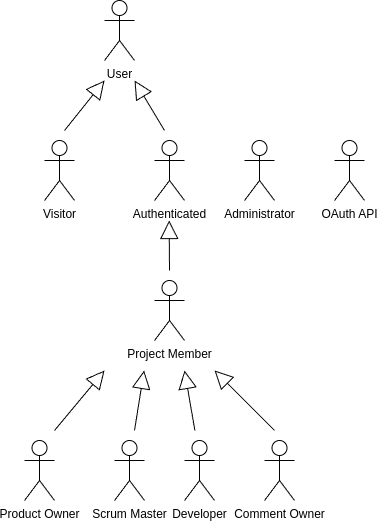
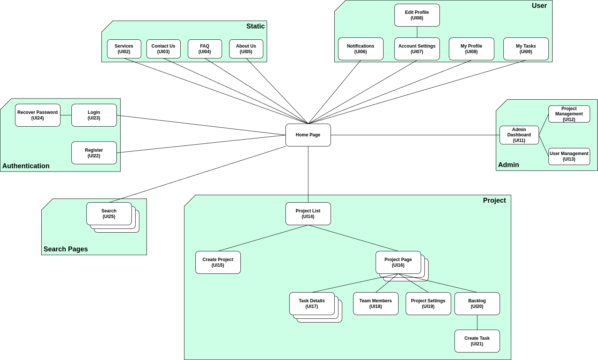
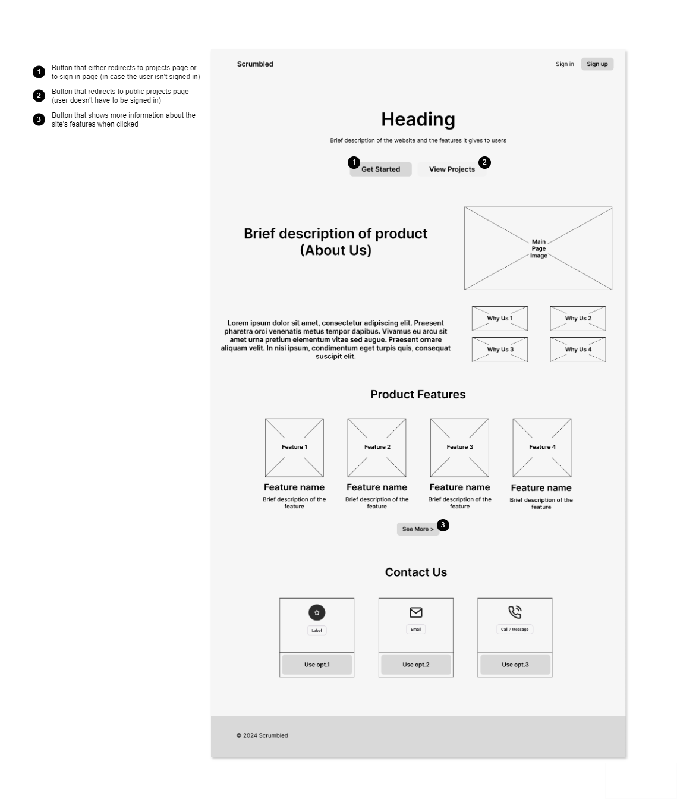
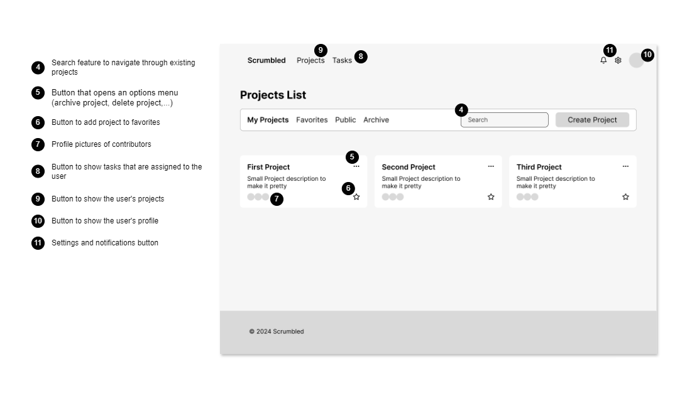
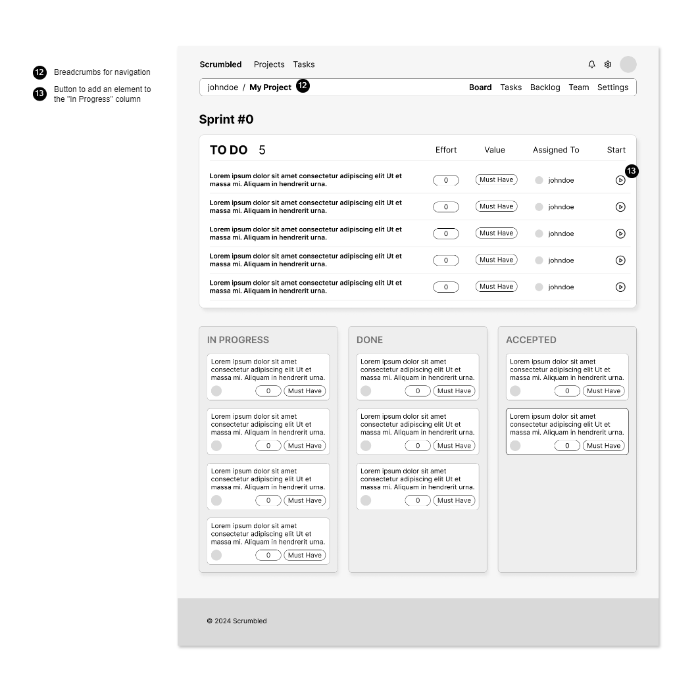
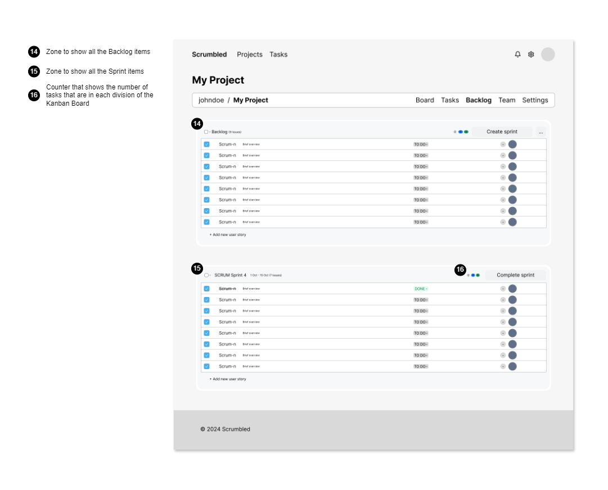

# ER:Requirements Specification Component

Scrumbled fosters an environment where agile project management is approachable and straightforward while enabling teams to adopt and master the Scrum methodology with ease. Improving team collaboration is key, with each sprint serving as an opportunity for effective, transparent, and targeted advancement.

## A1: Scrumbled

Scrumbled is a project management tool designed specifically for teams that want to follow the Scrum paradigm. Our goal is to give both beginners and experienced Scrum practitioners an easy-to-use interface without the overwhelming range of options seen in traditional project management software.

The primary objective of Scrumbled is to provide an intuitive web-based solution to facilitate Scrum processes and assist users who may not be acquainted with the technique. By simplifying the procedure and emphasizing key components, we hope to improve comprehension of Scrum principles and promote effective agile practices.

For users who are not signed in _Visitors_, the Scrumbled main page displays a brief overview of the site's capabilities giving them the options to learn more about Scrum methodology, sign in, sign up and search view public projects. For those who are signed in, the main page displays an overview of all active sprints, tasks, and projects that the user is a part of.

Once a _Visitor_ logs in successfully, they become an _Authenticated User_ and can access different project roles such as _Product Owner_, _Scrum Master_, or _Developer_. _Product Owners_ are responsible for managing all project-related activities, such as creating and approving tasks, managing team members, and establishing priorities. On the other hand, _Scrum Masters_ ensure that the project stays on track by monitoring sprint progress, setting up the Scrum board, and helping the team apply the Scrum methodology. The responsibility of developers is to oversee assigned tasks, see them through to completion, and collaborate with the team to accomplish sprint goals.

Tasks can be worked on by _Developers_ who can assign them to various team members or themselves. The tasks can be added, removed, and changed. In order to guarantee that everyone has the proper level of access and responsibility, they can also oversee the responsibilities of other project participants. Notifications helps the team stay in sync by keeping users informed of changes to their projects.

Scrumbled has powerful search capabilities in addition to project management, enabling users to look for particular tasks, projects, or other users. Teams can stay organized during their sprints and access pertinent information fast with the help of this feature.

In addition, the platform has a team of _Administrators_ who oversee the projects made by _Authenticated_ Users and keep an eye on the system. To make sure users follow the regulations, _Administrators_ have the ability to remove projects, manage user accounts (block, unblock and delete), and keep an eye on platform behavior. Despite not actively working on projects, _Administrators_ keep the platform's general structure and functionality up to date so that everyone can use it with ease.

The UI of Scrumbled is simple and responsive, making it compatible with desktop and mobile platforms alike. Teams can concentrate on their work without needless distractions thanks to the platform's simple, functional user interface, which also maintains a smooth, attractive appearance.

## A2: Actors and User Stories

Actors and User Stories artifact, outlines the specification of the actors and their user stories, together with the way that users will interact with the system.

### 1. Actors

<figure>

<figcaption>Figure 1: Scrumbled actors.</figcaption>
</figure>

| Identifier | Description | 
|------------|-------------| 
| User | Generic user that can browse public projects | 
| Visitor | Unauthenticated user that can view other users and public projects | 
| Authenticated | Authenticated users can create new projects and edit existing ones, depending on their role and permissions | 
| Project Member | General project member that is part of a project and can access tasks | 
| Product Owner | User that prioritizes features, creates and approves tasks | 
| Scrum Master | User that ensures the team follows agile practices and may also contribute to development tasks | 
| Developer | User that participates in a project, by assigning, commenting and asking for reviews in tasks | 
| Comment Owner | User that can edit and delete a certain comment | 
| Administrator | Administrators can delete, block and unblock user accounts | 
| OAuth API | External API that facilitates user registration and authentication within the platform |

<figcaption>Table 1: Scrumbled actors description.</figcaption>

### 2. User Stories

Section 2 contains the User stories. Each subsection represents an actor and there's a table inside that has an identifier, a name, a priority and a description for each user story (following the recommended pattern).

#### 2.1. Visitor

| Identifier | Name | Priority | Responsible | Description |
|------------|------|----------|-------------|-------------|
| US11 | Login | High | Simão | As a _Visitor_, I want to log into the system, so that I can have access to more information and use the system to it's fullest. |
| US12 | Register | High | Vanessa | As a _Visitor_, I want to register for an account, so that I can access it in the future. |
| US13 | Recover Password | Medium | Simão | As a _Visitor_, I want to recover my password, so that I can access my account if I forget my credentials. |

<figcaption>Table 2: Visitor user stories</figcaption>

#### 2.2. User

| Identifier | Name | Priority | Responsible | Description |
|------------|------|----------|-------------|-------------|
| US21 | See User Profile | High | Vanessa | As a _User_, I would like to have access to profiles, so that I can check people’s bio, public projects and email. |
| US22 | Exact Match Search | High | Vanessa | As a _User_, I want to be able to search for an exact string so that I quickly get to a User Profile. |
| US23 | Full-text Search | High | Simão | As a _User_, I want to be able to perform full-text search on project tasks so that I can find them easily. |
| US24 | Search Filters | High | António | As an _User_, I want to use search filters in places like project tasks, projects and profiles when searching for Projects so that I can find the project easily. |
| US25 | About US | Medium | Vanessa | As a _User_, I want an about us section, so that I can understand the project vision and get to know the people behind the project. |
| US26 | Product's Main Features | Medium | António | As a _User_, I want to be able to check the product's main features, so that I can check if the product is relevant to me and decide if I should start using the product. |
| US27 | Contact Information | Medium | João | As a _User_, I want to to be able to quickly get in contact with the people that manage the website, so that if a bug happens I can quickly give feedback or if I have a doubt I can contact someone easily. |
| US28 | Accept Project Invitation via email | Medium | Simão | As a _User_, I want to accept email invites, so that I can join and collaborate on my team's project. |
| US29 | Placeholders in Form Inputs | Medium | Vanessa | As a _User_, I want to see placeholders in form inputs, so that I know what is expected in each form. |
| US210 | Contextual Error Messages | Medium | António | As a _User_, I want to see error messages when I input incorrect information, so that I can correct my mistakes. |
| US211 | Contextual Help | Medium | João | As a _User_, I want to have access to contextual information, so that I can clarify any doubts I might have. |

<figcaption>Table 3: User user stories</figcaption>

#### 2.3. Authenticated

| Identifier | Name | Priority | Responsible | Description |
|------------|------|----------|-------------|-------------|
| US31 | Create Project | High | António | As an _Authenticated User_, I want to create a new Scrum project, so that I can set up a workspace for managing sprints, backlogs, and team members. |
| US32 | View My Projects | High | João | As an _Authenticated User_, I want to view all my Scrum projects, so that I can track the progress of multiple projects and access the necessary project information. |
| US33 | Logout | High | Simão | As an _Authenticated user_, I want to log out of the system, so that I can prevent unauthorized access though my device. |
| US34 | Edit Authenticated User's Profile | High | Vanessa | As an _Authenticated User_, I would like to change my profile, so that I can keep my information up to date. |
| US35 | Delete Account | Medium | Vanessa | As an _Authenticated user_, I want to delete my account, so that my personal information is permanently removed from the system. |
| US36 | User's Profile Picture | Medium | António | As an _Authenticated User_, I want to have a profile picture, so that people with the same name can be identified more easily. |
| US37 | Authenticated User's Notifications | Medium | João | As an _Authenticated User_, I would like to be able to check my notifications, so that I can quickly get up to date on the tasks I was assigned to and the projects I was invited to. |
| US38 | Mark Project as Favorite | Medium | Vanessa | As an _Authenticated User_, I want to mark certain projects as favorites, so that I can easily access my favorite projects. |
| US39 | Manage Project Invitation | Low | Vanessa | As an _Authenticated User_, I want to manage invitations to projects, so that I can decide whether to accept or decline requests to join different Scrum teams. |
| US310 | Private Profile | Low | Simao | As an _Authenticated User_, I want to set my profile as private so that no one can see my Profile, only my name and username. |

<figcaption>Table 4: Authenticated user stories</figcaption>

#### 2.4 Project Member

| Identifier | Name | Priority | Responsible | Description |
|------------|------|----------|-------------|-------------|
| US41 | Search Tasks | High | António | As a _Project Member_, I want to be able to search for tasks, so that I can easily find any task created in my projects. |
| US42 | Search over Multiple Attributes | High | João | As a _Project Member_, I want to search over multiple attributes when searching for tasks (such as State, Name, Value, Effort and Developers that are assigned to it) so that I can narrow my search and be able to see less results. |
| US43 | Leave Project | Medium | António | As a _Project Member_, I want the ability to leave a project that I created or joined, so that I can manage my involvement in various projects. |
| US44 | View Project Team | Medium | João | As a _Project Member_, I want to view the team members of a project I am involved in, so that I can understand who I am working with. |
| US45 | Change in Product Owner | Medium | Simão | As a _Project Member_, I want to be notified when there is a change in the Product Owner, so that I know who is responsible for managing the project. |
| US46 | View Team Members Profiles | Medium | Vanessa | As a _Project Member_, I want to be able to view my team members profiles, so that I can see the projects they are involved and the tasks they are working on. |
| US47 | Comment on Task | Medium | Simão | As an _Project Member_, I want to be able to comment on my project's tasks, so that I can express my thoughts and possibly help others. |
| US48 | View Project Board | Low | João | As a _Project Member_, I would like to see the board for the current sprint, so that I can evaluate the scrum process and the sprint’s evolution. |
| US49 | Edit Comment | Low | Simão | As a _Project Member_, I would like to edit a comment I made on a task, so that if I mess up I can correct it. |
| US410 | Delete Comment | Low | Vanessa | As a _Project Member_, I would like to delete a comment I made on a task, so that in the case where the comment is not relevant I can remove it. |
| US411 | View Task Details | High | Simão | As a _Project Member_, I want to view the task details, so that I know exactly what I have to do. |

<figcaption>Table 5: Project Member user stories</figcaption>

#### 2.5 Developer

| Identifier | Name | Priority | Responsible | Description |
|------------|------|----------|-------------|-------------|
| US51 | Complete an Assigned Task | High | João | As a _Developer_, I want to check an assigned task as possibly complete, so that I can organize myself better and inform others of the possibly completed task. |
| US52 | Assigned to Task | Medium | António | As a _Developer_, I want to be notified when I am assigned to a task, so that I can start working on it immediately. |
| US53 | Assign Tasks | Medium | João | As a _Developer_, I want to assign tasks to myself, or to other developers, so that the development process becomes smooth and that no two people implement the same thing. |

<figcaption>Table 6: Developer user stories</figcaption>

#### 2.6 Product Owner

| Identifier | Name | Priority | Responsible | Description |
|------------|------|----------|-------------|-------------|
| US61 | Create Task | High | Vanessa | As a _Product Owner_, I want to be able to add new tasks to the backlog, so that all work is organized and ready for the next or current sprint. |
| US62 | Manage Task Effort | High | João | As a _Product Owner_, I want to be able to change each task effort, so that priority of a given feature (task) can be changed. |
| US63 | Manage Task Value | High | Simão | As a _Product Owner_, I want to be able to change each task value, so that every team member can clearly understand what is the importance of the task. |
| US65 | Accept a Completed Task | High | António | As a _Product Owner_, I want to be able to accept the completion of a task, so that the Developers that are assigned know that the given task was accepted. |
| US66 | Add User to Project | High | João | As a _Product Owner_, I want to add a user to a project, so that the whole scrum team can join. |
| US67 | Assign New Product Owner | Medium | João | As a _Product Owner_, I want to assign a new _Product Owner_, so that the project can continue normally if I need to step down. |
| US68 | Remove Project Member | Medium | Simão | As a _Product Owner_, I want to remove members, so that I can restrict the access to the project and prevent old members from doing modifications to it. |
| US69 | Archive Project | Medium | Vanessa | As a _Product Owner_, I want to archive projects, so that I don't have a cluttered homepage full of project that do not need more attention. |
| US610 | Completed Task in Project Managed | Medium | António | As a _Product Owner_, I want to be notified when a task is completed in any project I manage, so that I can track progress and prioritize new tasks effectively. |
| US611 | Manage Members Permissions | Low | António | As a _Product Owner_, I would like to manage member permissions, so that I can easily identify who’s the _Scrum Master_ and who are the _Developers._ |
| US612 | Manage Project Invitation | Low | João | As a _Product Owner_, I would like to be able to manage project invitations, so that I can revoke them if I feel like one is no longer relevant. |
| US613 | Add task to sprint | Low | António | As a _Product Owner_, I want to be able to add new tasks to the sprint, so that developer can see and work on the selected tasks for the current sprint. |
| US614 | Delete My Project | Low | Simão | As a _Product Owner_, I want to be able to delete my projects, so that the information in them is deleted once the work is finished. |
| US615 | Private Projects | Low | António | As a project owner, I want to set my project as private so that only authorized team members and administrators can view it. |

<figcaption>Table 7: Product Owner user stories</figcaption>

#### 2.7 Scrum Master

| Identifier | Name | Priority | Responsible | Description |
|------------|------|----------|-------------|-------------|
| US71 | Edit Project Details | Medium | Simão | As a _Scrum Master_, I want to edit the project details, so that they stay updated in case the requirements change. |
| US72 | Accepted Invitation to Project | Medium | Vanessa | As a Scrum Master, I want to be notified when a user accepts an invitation to join my project, so that I can onboard them into the team. |

<figcaption>Table 8: Scrum Master user stories</figcaption>

#### 2.8 Administrator

| Identifier | Name | Priority | Responsible | Description |
|------------|------|----------|-------------|-------------|
| US81 | Search User Accounts | High | Simão | As an _Admin_, I want to be able to search for specific user accounts, so that I can easily find the users I want to act on. |
| US82 | View User Accounts | High | Vanessa | As an _Admin_, I want to be able to view user accounts, so that I can know the projects he is involved, the role he has and the comments he is making. |
| US83 | Edit User Accounts | High | António | As an _Admin_, I want to be able to edit user accounts, so that I can elevate or lower its privileges. |
| US84 | Create User Accounts | High | João | As an _Admin_, I want to be to create user accounts, so that I can test the way different roles interact with the platform. |
| US85 | Block User Accounts | Medium | António | As an _Admin_, I want to be able to block user accounts, so that users that disturb the work environment in the platform are punished. |
| US86 | Unblock User Accounts | Medium | João | As an _Admin_, I want to be able to unblock user accounts, so that users that were previously banned can comeback to the platform without having to register a second time. |
| US87 | Delete User Accounts | Medium | Simão | As an _Admin_, I want to be able to delete user accounts, so that the personal information of users that want to leave the platform or are permanently banned stays anonym. |
| US88 | Browse Projects | Medium | Vanessa | As an _Admin_, I want to be able to browse all the projects in the platform, so that I can easily navigate through all the projects in the platform in an easy and intuitive way. |
| US89 | View Project Details | Medium | António | As an _Admin_, I want to be able to view project details, so that I can keep an eye on the system and ensure the regulations are being followed. |
| US810 | Administrator Accounts | Medium | João | As an _Admin_, I want to have a administrator account with elevated privileges, so that I can oversee the projects made and make sure users follow the regulations. |
| US811 | Edit Projects | Low | Simão | As an _Admin_, I want to be able to edit projects, so that I can fix things if someone from the team asks. |
| US812 | Delete Projects | Low | António | As an _Admin_, I want to be able to delete projects, so that there are no projects that don't follow the regulations in the website. |

<figcaption>Table 9: Administrator user stories</figcaption> 

### 3. Supplementary Requirements

This section includes the business rules, technical requirements and the restrictions.

#### 3.1. Business rules

| Identifier | Name | Description |
|------------|------|-------------|
| BR01 | Account Deletion | Upon account deletion, shared user data is kept but is made anonymous |
| BR02 | Administrator Accounts | Administrator accounts are independent of the user accounts |
| BR03 | Banned Users | Banned users will have their information saved, but won't be eligible to enter the site with their credentials |
| BR04 | Public Project Access | In public projects, task interactions are limited to team members, while project information remains viewable to non-members. |
| BR05 | Project Archiving | Product Owners and Administrators can archive projects. Archived projects can still be viewed by team members and Administrators but cannot be modified. |
| BR06 | Project Ownership Transfer | After transfering ownership the original owner retains the role of Developer, unless reassigned. |
| BR08 | Minimum Password Requirements | User passwords must meet a minimum complexity standard, including a combination of uppercase, lowercase and numbers. |
| BR09 | Multiple Roles | A Team Member can only have one role in a project he is enrolled in except _Scrum Masters_ which are _Developers_ .|
| BR10 | Completed Sprint | When a sprint is marked as complete, all the tasks that weren't Accepted, will return to the project backlog. |
| BR11 | Delete PO Account | A Product Owner only can delete his account after deleting or transferring the project. |
| BR12 | Assign Task | A developer can't assign himself to a task that already has a developer assigned to it. |
| BR13 | Un-assigning a Task | A developer can't assign themselves to a task and then give up on the task. Only if they leave the project. |

<figcaption>Table 10: Business rules</figcaption>

#### 3.2. Technical requirements

| Identifier | Name | Description |
|------------|------|-------------|
| TR01 | Availability | The system must ensure an uptime of 99% or higher. |
| TR02 | Usability | The system should be intuitive and easy to navigate, requiring no prior experience. |
| TR03 | Web Application | The system must be designed as a web application featuring dynamic, responsive pages that function smoothly across any machine without requiring special software installation, using standard technologies such as HTML, CSS, PHP, and JavaScript. |
| TR04 | Security | The system should safeguard user data from unauthorized access or breaches. |
| TR05 | Robustness | The system must be capable of handling runtime errors without disrupting overall functionality. |
| TR06 | Scalability | The system must be designed to accommodate growth in user base and activity levels efficiently. |
| TR07 | Performance | The system should offer fast response times that ensure seamless user interaction. |
| TR08 | Accessibility | The system must be compatible with third-party accessibility tools to ensure usability for all individuals. |
| TR09 | Ethics | The system must adhere to the legal requirements of its operational regions and follow ethical standards in software development. |

<figcaption>Table 11: Technical requirements</figcaption>

The most important requirements are TR03 (Usability), TR04 (Security), and TR07 (Performance). Scrumbled needs to be a web-based platform that users can access from any machine without requiring special installations. Scrum teams often consist of distributed members using different devices, so the system’s ability to function seamlessly on any device, through standard web technologies, is crucial for accessibility and collaboration. Project management tools like Scrumbled often handle sensitive company information, including proprietary project details, timelines, resources, and confidential communication. Protecting this data from unauthorized access or breaches is essential to maintain trust and safeguard intellectual property. Fast response times are vital in a project management system to ensure smooth, uninterrupted interaction. Scrum teams work in fast-paced environments, and delays or slow system performance could hurt productivity, making daily Scrum tasks such as updating boards, assigning tasks, and tracking progress frustrating.

#### 3.3. Restrictions

| Identifier | Name | Description |
|------------|------|-------------|
| R01 | Deadline | The system should be ready to use by the end of the semester |
| R02 | Team Size | The system must be developed by a team of no more that four students |
| R03 | Database | The database should use PostgreSQL |

<figcaption>Table 12: Restrictions</figcaption>

## A3: Information Architecture

This artifact defines the logical structure of the website, mapping out hierarchies, ensuring users can intuitively navigate the site. Additionally, information architecture serves as foundation for the design and layout of the website, helping visualize the user journey, ensuring consistency in design and ease of access throughout the site.

### 1. Sitemap

Sitemap presenting the overall structure of the web application.

<figure>

<figcaption>Figure 2: Scrumbled Sitemap</figcaption>
</figure>

### 2. Wireframes

These wireframes show the blueprints for 4 Important Pages, Main Page, Projects List Page, Project Page and Project Backlog Page.

#### UI01: Main Page

<figcaption>Figure 3: Main Page wireframe</figcaption>

#### UI02: Projects List Page

<figcaption>Figure 4: Projects List Page wireframe</figcaption>

#### UI03: Project Page

<figcaption>Figure 5: Project Page wireframe</figcaption>

#### UI04: Project Backlog Page

<figcaption>Figure 6: Project Backlog Page wireframe</figcaption>

## Revision history

### 1st Changes 23/10/2024

- Changed Actor's description. Generic Users can no longer join and create projects;
- Now there is a "Comment Owner" actor, that represents team members who can delete and edit a certain ccomment;
- Every reference to a "post" was corrected to "comment";
- Corrected the repeated identifiers in "Product Owner" table;
- Changed US39 from "AuthenticatedUser" table to "ProjectMember" (now US47);
- Changed US45's name from "Change in Project Coordinator" to "Change in Product Owner";
- Changed the reference to "User Story" instead of "Task" on US42;
- Added a user story in "Product Owner"(US614) and "Administrator"(US811) about project deletion;
- Deleted BR that mentioned actions or permissions and made them user stories(Private Profile and Project);
- Added BR08, BR09, BR10, BR11 and BR12;
- Recover password is now an US of "Visitor".

### 2nd Changes 22/12/2024

- Changed some user stories to better align with Scrum and our vision of the project.

GROUP24113, 07/10/2024

* António Santos, up202205469@up.pt (Editor)
* João Santos, up202205794@up.pt
* Simão Neri, up202206370@up.pt
* Vanessa Queirós, up202207919@up.pt